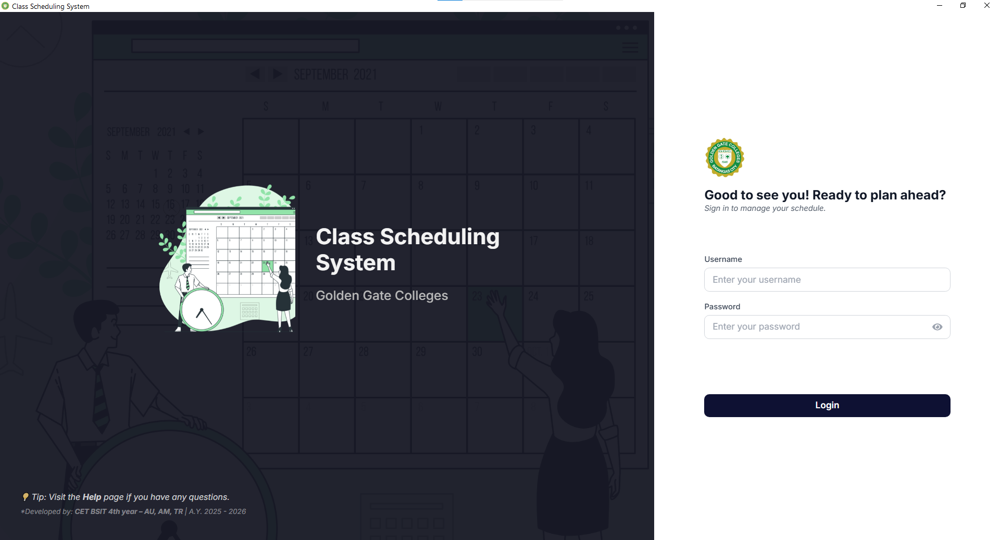
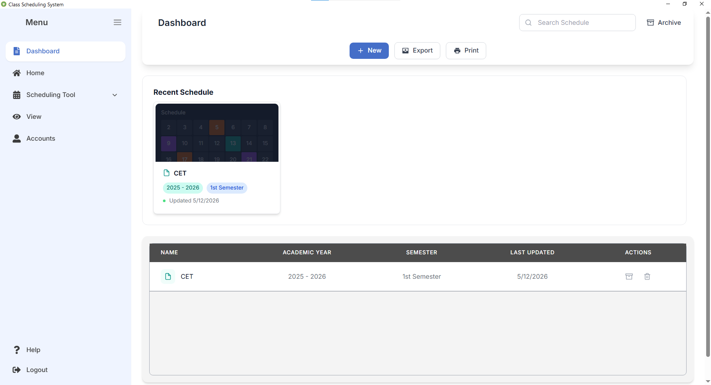
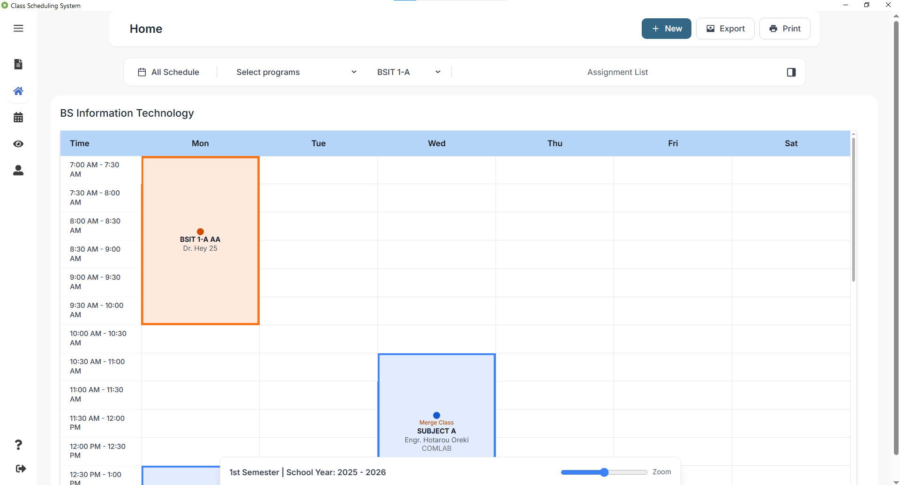
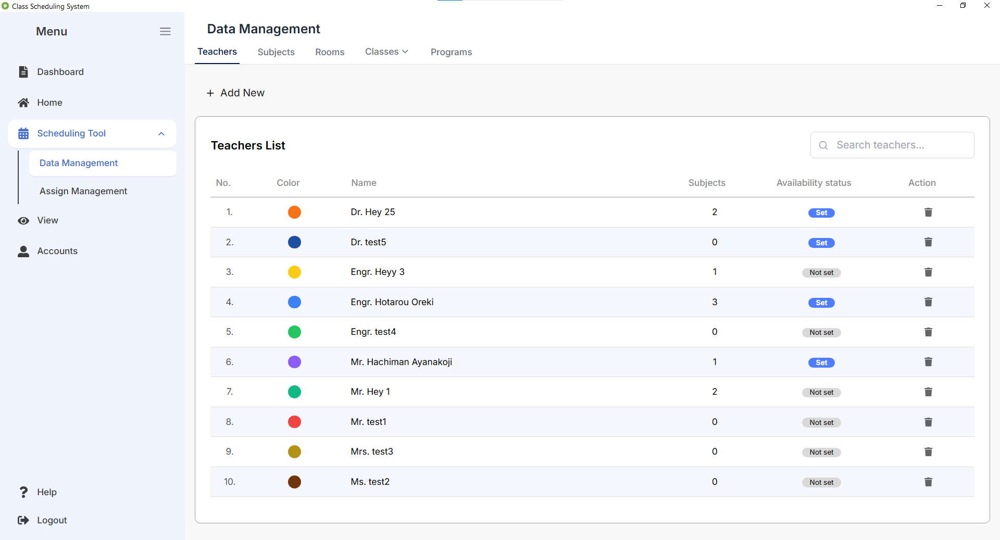
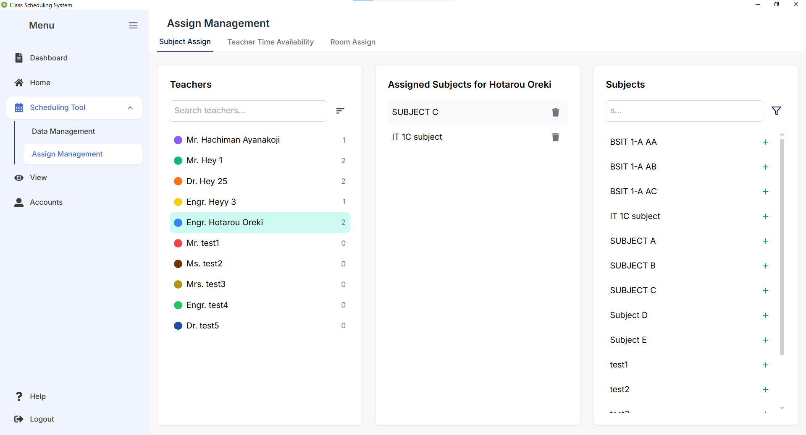
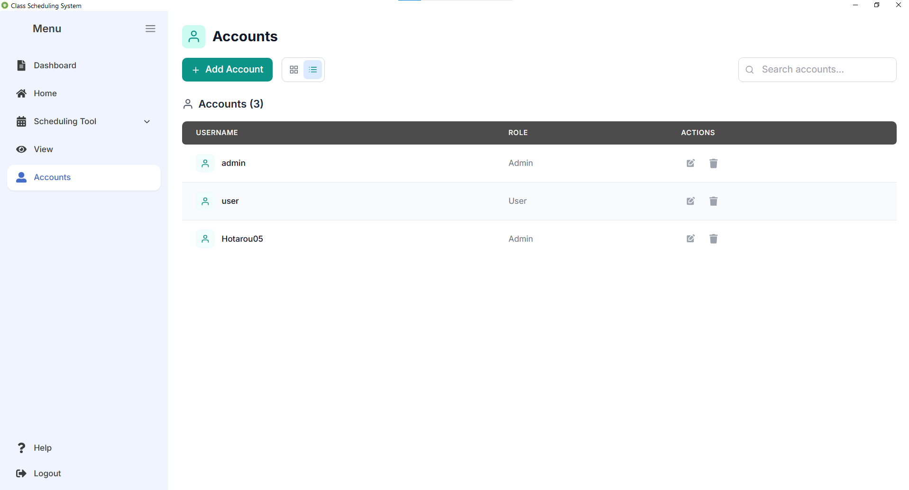
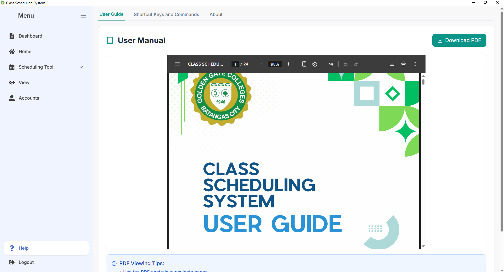
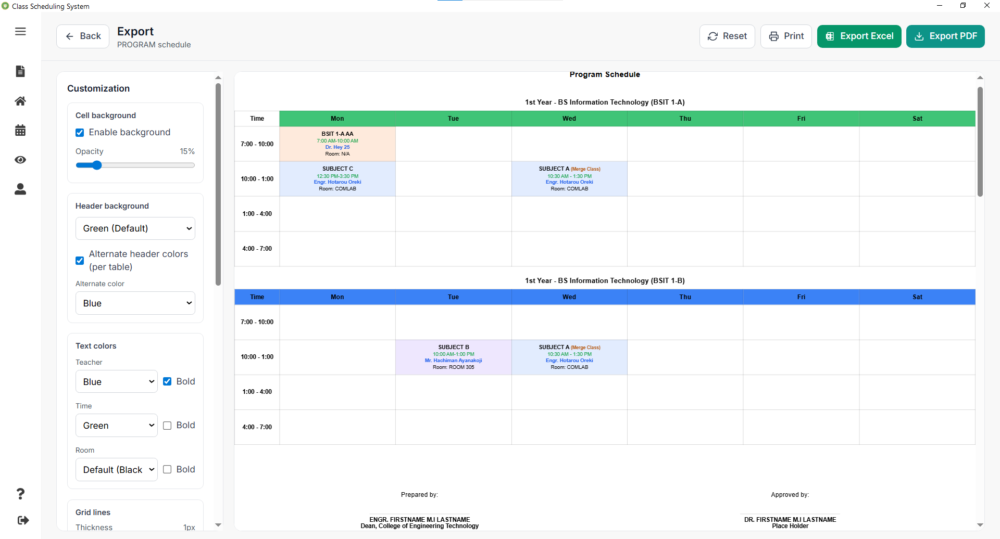
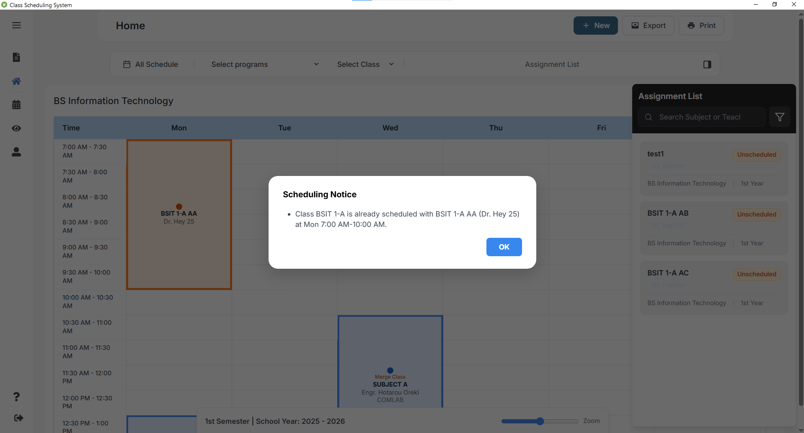
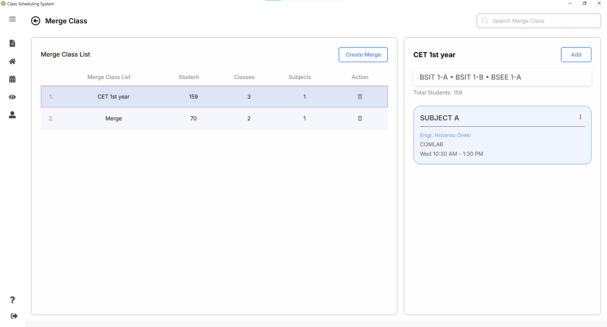

# CET Class Scheduling System

A desktop-based **Class Scheduling System** for **Golden Gate Colleges**, developed as a capstone project.
The system streamlines scheduling by reducing manual work, preventing conflicts, and ensuring timely release of schedules.

---

## 📚 Table of Contents

- [Features](#-features)
- [Screenshots](#-screenshots)
- [Setup Instructions](#-setup-instructions)
- [Database Setup](#-database-setup-sqlite3)
- [Shortcut Keys](#-shortcut-keys)
- [Help & Documentation](#-help--documentation)
- [About](#-about)
- [License](#-license)

---

## ✨ Features

- 🔑 **Authentication** – Secure login for users.
- 📊 **Scheduling** – Drag and Drop scheduling with auto conflict detection.
- 🏫 **Multi-Program Support** – Manage schedules across multiple departments.
- ⚡ **Real-Time Updates** – Instantly see changes when assigning faculty or rooms.
- 🎨 **Modern UI** – Built with **React + Tailwind**.
- 💾 **Local Database** – Automatic Data stored in **SQLite3** for fast, offline access.
- 📂 **File Management** – Create, save, export, and print schedules.
- 📋 Customization Report – Generate, filter, and adjust tailored schedule overviews.

---

## 📸 Screenshots

<div style="display: grid; grid-template-columns: repeat(auto-fit, minmax(250px, 1fr)); gap: 16px;">

  <div>
    <h4>Login</h4>
    
  </div>

  <div>
    <h4>File Dashboard</h4>
    
  </div>

  <div>
    <h4>Home</h4>
    
  </div>

  <div>
    <h4>Data Management</h4>
    
  </div>

  <div>
    <h4>Assigning Management</h4>
    
  </div>

  <div>
    <h4>Accounts</h4>
    
  </div>

  <div>
    <h4>Help</h4>
    
  </div>

  <div>
    <h4>Customization</h4>
    
  </div>

  <div>
    <h4>Drag & Drop with Conflict Detection</h4>
    
  </div>

  <div>
    <h4>Merge Class</h4>
    
  </div>

</div>

---

## ⚙️ Setup Instructions

```bash
# 1. Clone the repository
git clone https://github.com/aumali05/CET-Class-Scheduling-System.git
cd CET-Class-Scheduling-System

# 2. Install dependencies
npm install

# 3. Run in development mode
npm run dev

# 4. Run with Electron
npm run electron:dev

# 5. Build for production
npm run build
npm run electron:build
```

---

## 🗄️ Database Setup (SQLite3)

- The database (`database.sqlite`) is auto-generated on first run.
- Use `/db/schema.sql` for schema initialization.

---

## ⌨️ Shortcut Keys

### Main Actions

| Action     | Shortcut     |
| ---------- | ------------ |
| New File   | Ctrl+N       |
| Save       | Ctrl+S       |
| Save As    | Ctrl+Shift+S |
| Export     | Ctrl+E       |
| Print      | Ctrl+P       |
| Help       | Ctrl+H       |
| Close File | Ctrl+W       |

### Navigation

| Action                         | Shortcut |
| ------------------------------ | -------- |
| File Page                      | Ctrl+1   |
| Home Page                      | Ctrl+2   |
| Data Management (Scheduling)   | Ctrl+3   |
| Assign Management (Scheduling) | Ctrl+4   |
| Toggle View Tools              | Ctrl+5   |
| Help Page                      | Ctrl+H   |
| Logout / Login Page            | Ctrl+L   |
| Toggle Sidebar                 | Ctrl+B   |

### View Tools

| Action      | Shortcut        |
| ----------- | --------------- |
| Zoom In     | Ctrl++ / Ctrl+= |
| Zoom Out    | Ctrl+-          |
| Full Screen | Ctrl+F / F11    |

### General

| Action      | Shortcut |
| ----------- | -------- |
| Close Modal | Escape   |

_(More detailed shortcuts available in the in-app **Help** section.)_

---

## 📖 Help & Documentation

- Built-in **Help tab** with:
  - User Guide (PDF)
  - Shortcut Keys & Commands
  - About section with developer details

---

## ℹ️ About

Golden Gate Colleges, established in **1946**, is the first private higher education institution in Batangas.
This project aims to replace manual scheduling (Word/Excel) with an automated system, reducing workload and minimizing conflicts, especially in the **Engineering and Technology Department**.
The project are Developed by 3 members: Allan Joseph Umali, Tai Lee Rementila and Angelo Mendozan for the Academic Requirements.

---

## 📜 License

This project is licensed under the **MIT License**.

focus:outline-none
focus:ring-2 focus:ring-blue-500
focus:border-blue-500
